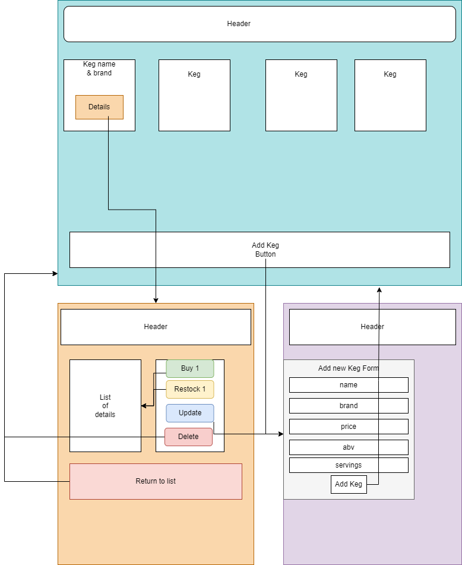

# Tap Room

#### This application implements the use of CRUD and state changes in a basic React app.

#### By Connor Hansen

## Technologies Used

* React
* JavaScript/JSX
* HTML
* CSS/Bootstrap
* Node Package Manager

## Description

_This is primarily an app to demonstrate a basic React app integrating state and full CRUD capabilities. Users may create, view details, update, delete, "buy"/"restock" kegs and their contents._



## Setup/Installation Requirements

- _To clone and run from [GitHub Repo](https://github.com/chansen1395/tap-room):_

- _Use a program such as VSCode to view, run, and test the program._


- _In order to set up and run the project, in bash at a
 folder of your choice, type the following:_
    1. **$ git clone https://github.com/chansen1395/tap-room.git**
    2. **$ code .**
    3. **$ cd YourFolder.Solution/ParkLookup**
    4. **Install packages if not already installed:**
    ```
      $ npm install --save-exact react-scripts@3.2.0
      $ npm install react-bootstrap bootstrap@5.1.3
    ```
    5. **$ npm watch run**
    6. **navigate to http://localhost:3000/ in your browser to use the app**
    

- **Data Schema**

| Keg       |
| --------- |
| Name      |
| Brand     | 
| Price     | 
| ABV       | 
| Quantity  | 


## Future Features

* _Allow a user to add multiple beverages to a "cart" and check out._

## Known Bugs

* _On the keg details page, styling slightly overlaps a button._

## License

{Let me know if you run into any issues or have questions, ideas or concerns. I encourage you to contact me or make a contribution to the code.}

## Contact Information

- Connor Hansen: _{<chansen13@georgefox.edu>}_
- _{[GitHub Repo - main](https://github.com/chansen1395/tap-room)}_
